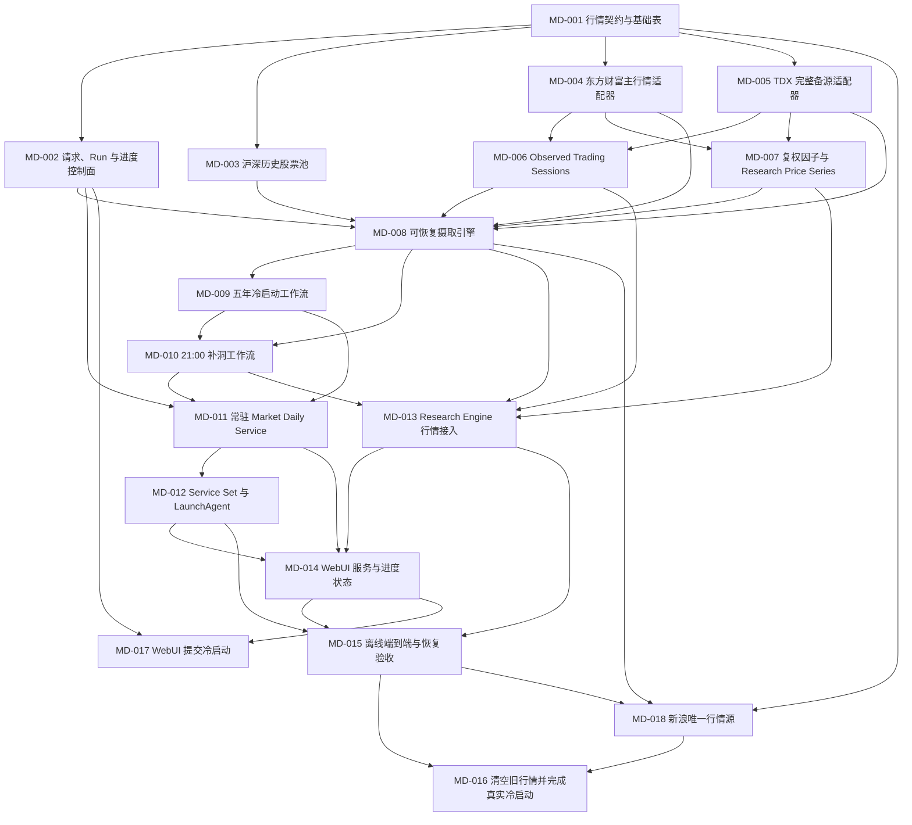

# Market Daily 冷启动与常驻服务 tickets

本目录把 [领域语言](../../../CONTEXT.md) 和 [ADR](../../adr/) 转换为可实施、可验收的 Market Daily 工作项。所有 tickets 属于同一轮直接改造：只保留新契约和新运行入口，不建设旧行情兼容层；MD-016 完成前，本轮能力不视为正式可用。当前实时路径以 MD-018 和 ADR-0057 为准；MD-004、MD-005 及其主备源描述仅保留为历史实施记录，不属于运行架构。

## 依赖图

## Ticket 索引

| ID | 标题 | 依赖 | 状态 |
|---|---|---|---|
| [MD-001](MD-001-market-contracts-and-schema.md) | 行情领域契约与 SQLite 基础表 | 无 | 已完成 |
| [MD-002](MD-002-request-run-control-plane.md) | Request、Run 与进度控制面 | MD-001 | 已完成 |
| [MD-003](MD-003-historical-sh-sz-universe.md) | 沪深历史股票池 | MD-001 | 已完成 |
| [MD-004](MD-004-eastmoney-primary-provider.md) | 东方财富主行情适配器（历史，已停用） | MD-001 | 已被 MD-018 取代 |
| [MD-005](MD-005-tdx-fallback-provider.md) | TDX 完整备源适配器（历史，已停用） | MD-001 | 已被 MD-018 取代 |
| [MD-006](MD-006-observed-trading-sessions.md) | Observed Trading Sessions | MD-004, MD-005 | 已完成 |
| [MD-007](MD-007-adjustment-factors-and-research-prices.md) | 复权因子与 Research Price Series | MD-004, MD-005 | 已完成 |
| [MD-008](MD-008-resumable-ingestion-engine.md) | 可恢复 Market Daily 摄取引擎 | MD-002…MD-007 | 已完成 |
| [MD-009](MD-009-five-year-cold-start.md) | 五年全市场冷启动工作流 | MD-008 | 已完成 |
| [MD-010](MD-010-gap-aware-daily-catch-up.md) | 21:00 增量补洞工作流 | MD-008, MD-009 | 已完成 |
| [MD-011](MD-011-long-running-market-daily-service.md) | 常驻 Market Daily Service | MD-002, MD-009, MD-010 | 已完成 |
| [MD-012](MD-012-service-set-and-launchagent.md) | Service Set 与 LaunchAgent 能力 | MD-011 | 已完成 |
| [MD-013](MD-013-research-engine-market-integration.md) | Research Engine 行情接入 | MD-006…MD-008, MD-010 | 已完成 |
| [MD-014](MD-014-webui-service-and-progress-status.md) | WebUI 服务与进度状态 | MD-011…MD-013 | 已完成 |
| [MD-015](MD-015-offline-end-to-end-and-recovery.md) | 离线端到端与恢复验收 | MD-012…MD-014 | 已完成 |
| [MD-016](MD-016-live-reset-and-cold-start.md) | 清空旧行情并完成真实冷启动 | MD-015 | 进行中 |
| [MD-017](MD-017-webui-cold-start-control.md) | WebUI 提交五年冷启动 | MD-002, MD-014 | 已完成 |
| [MD-018](MD-018-sina-only-market-source.md) | 新浪唯一行情源与共享限流 | MD-001, MD-008, MD-015 | 已完成 |

## 统一完成标准

每个 ticket 除自身验收条件外，还必须满足：

- 遵守根目录 `agents.md`，不得使用任何 Superpowers skill 或 workflow。
- 新增或修改的行为必须有自动化测试；Provider 测试只使用固定 fixture，自动化测试不得访问实时网络。
- 所有日期时间显式使用 `Asia/Shanghai` 或带偏移的时间戳，拒绝未来数据。
- Market Daily 实时路径只使用新浪公开接口，全部请求共享每秒 2 次限流器；不得接入备源或要求数据源密钥。
- 适配器边界统一价格和成交量单位；成交额来源未提供时必须为 `NULL`，不得伪造为 0 或跨来源补字段。
- 不引入 TradingAgents、`mootdx`、外部 Agent 运行时或新的行情存储引擎。
- 运行 ticket 指定的 Python 测试；MD-015 起必须运行完整 `./.venv311/bin/python -m pytest tests/advisor`。
- 每次代码改动后执行 `/Users/mac/.local/share/chrome-devtools-mcp/node/bin/node scripts/self-test.mjs`。
- 运行 `git diff --check`，并确认没有覆盖用户已有的无关改动。
- 用户可见的状态、文档和 WebUI 文案使用易懂中文。

MD-016 是实机上线门；在其真实 Run 与验收条件全部完成前，Market Daily 基线不视为正式可用。
