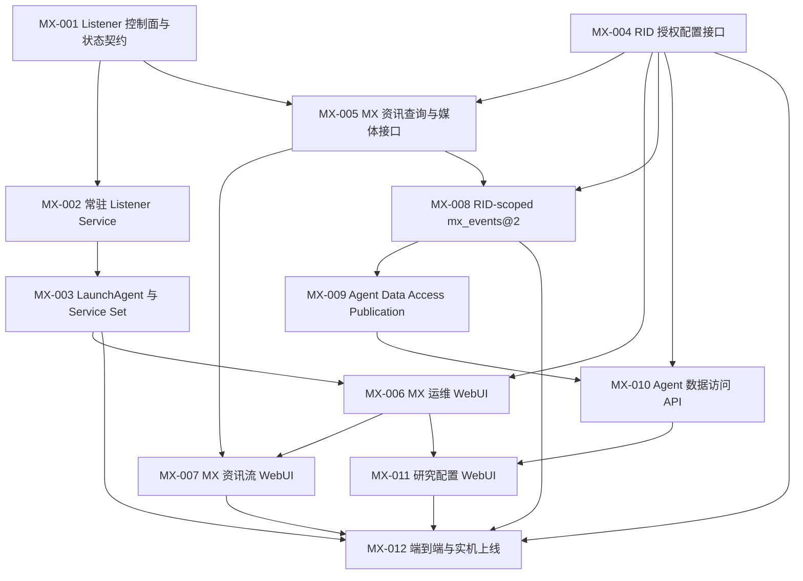

# MX Listener 常驻服务、资讯台与 Agent 数据访问 tickets

本目录把 [领域语言](../../../CONTEXT.md) 与 [ADR](../../adr/) 转换为可实施、可验收的 MX Listener 工作项。目标是在不自动操作 Chrome、MX 页面或登录的前提下，把被动 Listener 纳入 A Hunter Service Set，同时提供显式专用 Chrome 启动、RID 授权配置、历史资讯浏览、RID-scoped Data Product 和版本化 Agent Data Access。MX-012 的离线验收、真实事件库迁移和 LaunchAgent 上线已经完成；服务当前健康等待用户提供浏览器前置条件，完成 listening/撤销/恢复链路前本轮能力不视为正式验收完成。

## 已确认边界

- 常驻的是 MX Listener Service；专用 Chrome 只能由用户在 WebUI 显式启动，MX 页面和交互式登录仍由用户提供。
- Listener 在依赖缺失时保持存活并等待，绝不导航、刷新、点击、输入或注入页面。
- `config/allowed-rids.yaml` 是 RID Authorization Set 的唯一权威；只有用户能显式增加 RID。
- 删除 RID 停止未来采集和研究使用，但不删除 Accepted MX Events；依赖已撤销 Feed 的 Agent/Team 失败关闭。
- MX Information View 只展示用户友好的规范化内容和安全媒体，不返回原始载荷或调试标识。
- Agent 配置的是 Data Products 与明确的 MX RID Feeds，不是 Provider；变更会发布新的不可变 Agent Manifest 版本。

## 依赖图

## Ticket 索引

| ID | 标题 | 依赖 | 状态 |
|---|---|---|---|
| [MX-001](MX-001-listener-control-plane.md) | Listener 控制面、租约与三维状态契约 | 无 | 已完成 |
| [MX-002](MX-002-long-running-listener-service.md) | 常驻 MX Listener Service 与安全恢复 | MX-001 | 已完成 |
| [MX-003](MX-003-launchagent-and-service-set.md) | LaunchAgent 与统一 Service Set 生命周期 | MX-002 | 已完成 |
| [MX-004](MX-004-rid-authorization-web-api.md) | RID Authorization Set 深模块与 Web API | 无 | 已完成 |
| [MX-005](MX-005-information-query-api.md) | MX Information View 查询、检索与媒体 API | MX-001, MX-004 | 已完成 |
| [MX-006](MX-006-mx-operations-webui.md) | 顶层导航与 MX 运维 WebUI | MX-003, MX-004 | 已完成 |
| [MX-007](MX-007-information-feed-webui.md) | 用户友好的 MX 历史资讯流 | MX-005, MX-006 | 已完成 |
| [MX-008](MX-008-rid-scoped-data-product.md) | RID-scoped `mx_events@2` 与 Snapshot 隔离 | MX-004, MX-005 | 已完成 |
| [MX-009](MX-009-agent-data-access-publication.md) | 不可变 Agent Data Access Publication | MX-008 | 已完成 |
| [MX-010](MX-010-agent-data-access-api.md) | Data Product Catalog 与 Agent Access API | MX-004, MX-009 | 已完成 |
| [MX-011](MX-011-research-configuration-webui.md) | Agent 数据访问与 Team 研究配置 WebUI | MX-006, MX-010 | 已完成 |
| [MX-012](MX-012-end-to-end-and-live-rollout.md) | 离线端到端、运维文档与实机上线 | MX-003, MX-004, MX-007, MX-008, MX-011 | 迁移与服务完成，待浏览器链路 |

## 统一完成标准

每个 ticket 除自身验收条件外，还必须满足：

- 遵守根目录 `agents.md`；不得使用 Superpowers、`writing-plans`、`using-git-worktrees` 或 `test-driven-development` workflow。
- 所有 Collector 与 Node 测试命令使用 `/Users/mac/.local/share/chrome-devtools-mcp/node/bin/node`。
- 每个测试命令在新的 `/bin/zsh -f` 中运行，清除全部 HTTP/HTTPS/ALL proxy 变量，并设置 `NO_PROXY='*' no_proxy='*'`。
- 自动化测试只使用临时目录、fixture、fake CDP 和 fake clock；不得连接真实 MX、操作 Chrome、修改真实 `config/allowed-rids.yaml`、`data/state/events.sqlite`、媒体或 LaunchAgents。
- 只有用户能提供 RID；任何界面、日志、测试或迁移都不得从流量推断、建议或自动加入 RID。
- 空 RID Authorization Set 继续表示故意停用采集；无授权内容不得入库或下载媒体。
- WebUI 与 API 不返回 raw payload、原始媒体 URL、Cookie、令牌、Socket.IO 会话或 Chrome 调试标识。
- 所有读取和分页有明确上限；所有写入原子、可并发验证并失败关闭。
- 新增或修改行为有自动化测试；每次代码改动后运行仓库 Node 离线自检。
- 用户可见状态、校验与操作反馈使用易懂中文；不生成投资结论，不连接券商，不执行交易。
- 运行 `git diff --check`，并确认没有覆盖用户已有的无关改动。

MX-012 是实机上线门；真实迁移与 LaunchAgent 已在用户授权后完成。Listener 保持被动等待，只有用户从 WebUI 显式启动专用 Chrome、自行登录并打开已授权页面后，才继续最后的浏览器恢复验收。
