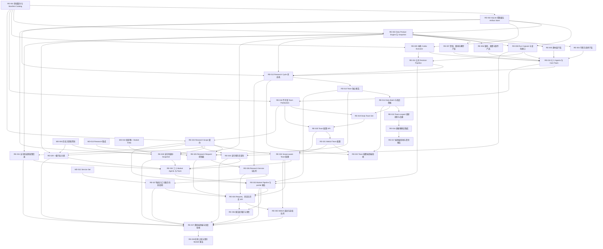

# Self-contained Research Engine tickets

本目录把 [领域语言](../../../CONTEXT.md) 和 [ADR](../../adr/) 转换为可实施、可验收的工作项。RE-001～RE-017 完成了自包含 Research Engine 的直接替换与首份报告；RE-018～RE-022 在同一引擎上增加个人本地 WebUI Team 配置能力；RE-023～RE-038 继续在同一个引擎上增加显式 Research Scope、Market Teams、持久化 Research Service、WebUI 即时触发、全局进度和分页报告查询，不引入第二套 Agent/Team 生命周期或执行系统。

## 依赖图

## Ticket 索引

| ID | 标题 | 依赖 | 状态 |
|---|---|---|---|
| [RE-001](RE-001-domain-contracts-and-catalog.md) | 领域契约与 Manifest Catalog | 无 | 完成 |
| [RE-002](RE-002-control-plane-and-artifact-store.md) | SQLite 控制面与 Artifact Store | RE-001 | 完成 |
| [RE-003](RE-003-data-product-engine-and-snapshots.md) | Data Product Engine 与 Snapshot | RE-001, RE-002 | 完成 |
| [RE-004](RE-004-market-and-technical-products.md) | 行情与技术 Data Products | RE-003 | 完成 |
| [RE-005](RE-005-fundamental-products.md) | 基本面 Data Products | RE-003 | 完成 |
| [RE-006](RE-006-information-products.md) | 新闻、政策与事件 Data Products | RE-003 | 完成 |
| [RE-007](RE-007-market-structure-products.md) | 资金、题材与解禁 Data Products | RE-003 | 完成 |
| [RE-008](RE-008-run-capsules-and-query-interface.md) | Run Capsule 与只读查询接口 | RE-002, RE-003 | 完成 |
| [RE-009](RE-009-local-codex-executor.md) | 本机 Codex Executor 与统一执行策略 | RE-001, RE-002 | 完成 |
| [RE-010](RE-010-seven-agents-and-core-team.md) | 七个 Research Agents 与 Core Team | RE-004…RE-009 | 完成 |
| [RE-011](RE-011-decision-pipeline.md) | 公共 Decision Pipeline | RE-008, RE-009 | 完成 |
| [RE-012](RE-012-research-cycle-state-machine.md) | Research Cycle 状态机 | RE-002, RE-003, RE-010, RE-011 | 完成 |
| [RE-013](RE-013-independent-team-reports.md) | Team 独立报告 | RE-012 | 完成 |
| [RE-014](RE-014-daily-batches-and-briefs.md) | Daily Batch 与 Team 每日简报 | RE-013 | 完成 |
| [RE-015](RE-015-team-scoped-reviews.md) | Team-scoped 投研投影与复盘 | RE-014 | 完成 |
| [RE-016](RE-016-direct-replacement.md) | 直接替换外部集成 | RE-015 | 完成 |
| [RE-017](RE-017-end-to-end-first-report.md) | 端到端验收与首份报告 | RE-016 | 完成 |
| [RE-018](RE-018-immutable-team-publication.md) | 不可变 Team Publication | RE-001, RE-010 | 完成 |
| [RE-019](RE-019-daily-team-set.md) | Daily Team Set | RE-014, RE-018 | 完成 |
| [RE-020](RE-020-team-configuration-api.md) | Team Catalog 与配置 API | RE-018, RE-019 | 完成 |
| [RE-021](RE-021-webui-team-configuration.md) | WebUI 配置 Research Teams | RE-020 | 完成 |
| [RE-022](RE-022-team-configuration-end-to-end.md) | Team 配置端到端验收 | RE-012, RE-014, RE-021 | 完成 |
| [RE-023](RE-023-research-scope-contracts.md) | 显式 Research Scope 契约 | RE-001, RE-018 | 完成 |
| [RE-024](RE-024-scope-aware-team-configuration.md) | Scope-aware Team 配置 | RE-020, RE-021, RE-023 | 完成 |
| [RE-025](RE-025-research-request-control-plane.md) | Research Request 与 Record 控制面 | RE-002, RE-013, RE-023 | 完成 |
| [RE-026](RE-026-research-service-and-queue.md) | Research Service 与全局队列 | RE-012, RE-025 | 完成 |
| [RE-027](RE-027-research-trigger-adapters-and-service-lifecycle.md) | Research 触发入口与服务生命周期 | RE-026, MD-012 | 完成 |
| [RE-028](RE-028-whole-market-intraday-snapshot.md) | Whole-Market Intraday Snapshot | RE-003, RE-023, MD-003, MD-018 | 完成 |
| [RE-029](RE-029-industry-sector-taxonomy.md) | 版本化一级行业分类快照 | RE-003, RE-023, MD-003 | 完成 |
| [RE-030](RE-030-whole-market-history-query.md) | 全市场历史查询能力 | RE-008, RE-023, MD-013 | 完成 |
| [RE-031](RE-031-market-information-product.md) | 全市场宏观政策信息产品 | RE-003, RE-023 | 完成 |
| [RE-032](RE-032-initial-market-agents-and-team.md) | 三名初始 Market Agents 与 Overview Team | RE-024, RE-028～RE-031 | 完成 |
| [RE-033](RE-033-market-decision-pipeline-and-partial-reports.md) | Market Decision Pipeline 与 partial 报告 | RE-011, RE-013, RE-023, RE-032 | 完成 |
| [RE-034](RE-034-research-request-and-history-api.md) | Research Request、状态与历史 API | RE-024～RE-027, RE-033 | 完成 |
| [RE-035](RE-035-webui-research-launch-and-current-queue.md) | WebUI 即时启动与全局队列 | RE-024, RE-034 | 完成 |
| [RE-036](RE-036-webui-report-explorer-and-detail.md) | 分页报告查询区与详情页 | RE-033, RE-034 | 完成 |
| [RE-037](RE-037-scope-research-offline-end-to-end.md) | Scope Research 离线端到端与恢复验收 | RE-027～RE-031, RE-033, RE-035, RE-036 | 完成 |
| [RE-038](RE-038-live-market-research-rollout.md) | 实机上线与首份 Market Team 报告 | RE-037 | 待用户授权上线 |

## 统一完成标准

每个 ticket 除自身验收条件外，还必须满足：

- 遵守根目录 `agents.md`，不得使用任何 Superpowers skill 或 workflow，也不为个人项目增加多用户、权限、协作或通用产品化复杂度。
- 新增或修改的行为有自动化测试；联网 Provider 测试使用固定 fixture，不在单元测试中访问外部网络。
- 所有时间输入显式携带时区和 `as_of`，任何晚于边界的数据都被拒绝。
- 不创建订单、不调用券商、不修改账本来表达研究建议。
- 不引入 Team 间聚合、比较、排名或共识输出。
- Market 与 Security Agent/Team 除 Research Scope 及其直接输入/输出契约外共用 Manifest、版本、Data Access、Capsule、Query、执行、重试、审计和生命周期实现。
- 所有 WebUI、CLI 与 scheduler 研究入口只提交 durable Research Request；只有 Research Service 执行 Cycle，且不按 Team/Subject/日期设置每日限制。
- Market Daily 继续遵守 MD-018 的新浪唯一源；Whole-Market Intraday Snapshot 的新浪主源/东财整包备源仅属于独立 Research Data Product，不能渗入日线摄取路径。
- `a_share_market_overview@1` 及其三个初始 Agents 不得输出 Research Candidate、个股 stance、价格、仓位或交易动作。
- Research Report Explorer 使用服务端分页和 Team 筛选，按 publication time 排序；不得重新引入首页 Primary Team、Agent 报告筛选或 recent-100 截断。
- 用户可见的 Team 状态、校验和操作反馈全部使用易懂中文，不显示证据覆盖警告。
- 运行相关 Python 测试；ticket 未另行限定时至少运行 `./.venv311/bin/python -m pytest tests/advisor`。
- 每次代码改动后执行仓库要求的离线检查：`/Users/mac/.local/share/chrome-devtools-mcp/node/bin/node scripts/self-test.mjs`。
- 运行 `git diff --check`，并确认没有覆盖用户已有的无关改动。

RE-017 已完成 Research Engine 基线；RE-022 已完成 WebUI Team 配置能力的发布验收；RE-023～RE-037 已完成本轮 Scope、Market Research、Research Service 与报告查询能力的离线实现和验收。RE-038 的上线手册与保护措施已交付，但安装 Service、访问真实 Provider 和生成首份实机报告须等待用户明确授权。
